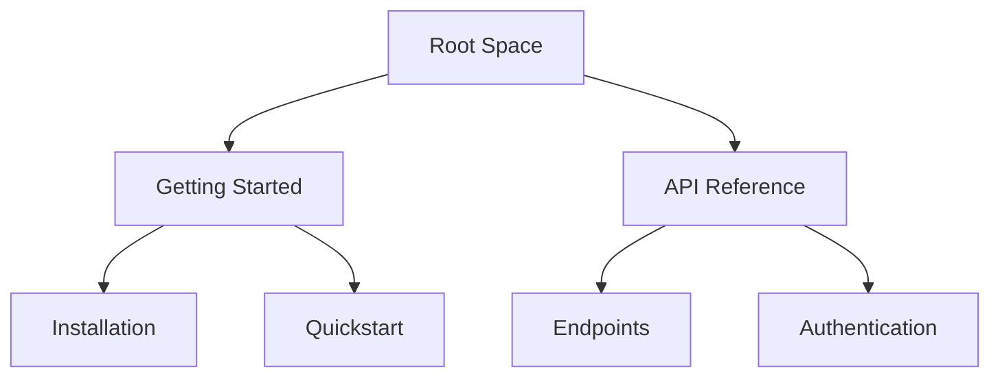

## Overview

Personal provides powerful tools to streamline your documentation workflow. You organize content hierarchically, collaborate seamlessly with teams, track changes with version control, and find information quickly using advanced search features. These core capabilities ensure your project docs stay current and accessible.

<Callout kind="tip">
  Start by creating a new space in your dashboard at `https://dashboard.example.com` to experience these features firsthand.
</Callout>

## Key Features

Explore the essential capabilities at a glance.

<Columns cols={2}>
  <Card title="Document Organization" icon="folder" href="#document-organization">
    Build intuitive hierarchies with nested pages and folders.
  </Card>
  <Card title="Collaboration" icon="users" href="#collaboration">
    Share docs securely and invite team members effortlessly.
  </Card>
  <Card title="Version Control" icon="git-branch" href="#version-control">
    Track edits, revert changes, and maintain history automatically.
  </Card>
  <Card title="Search Tools" icon="search" href="#search-tools">
    Filter and discover content with powerful queries.
  </Card>
</Columns>

## Document Organization and Hierarchy

You structure your documentation using nested pages and folders, creating a clear information architecture. Drag and drop pages to reorder, and use frontmatter for metadata.



<Steps>
  <Step title="Create a Folder" icon="folder-plus">
    Navigate to your space and select `New Folder` from the menu.
  </Step>
  <Step title="Add Nested Pages" icon="file-plus">
    Inside the folder, create child pages using the `+ Page` button.
  </Step>
  <Step title="Reorder Content" icon="move">
    Drag pages in the sidebar to adjust the hierarchy.
  </Step>
</Steps>

## Collaboration and Sharing Options

Invite team members and control access levels. You generate shareable links with permissions like view-only or edit.

<Tabs>
  <Tab title="Team Invite" icon="users">
    Send invites via email. Set roles: Admin, Editor, Viewer.
  </Tab>
  <Tab title="Public Links" icon="link">
    Toggle public access and customize permissions.
    
    <CodeGroup tabs="Markdown Embed,Link Share">
    ````markdown
    Embed your docs:
    ```
    [](https://dashboard.example.com/your-space)
    ```
    ````
    ````markdown
    Direct link: https://dashboard.example.com/public/your-space
    ````
    </CodeGroup>
  </Tab>
</Tabs>

<Callout kind="alert">
  Always review permissions before sharing sensitive project docs.
</Callout>

## Version Control for Docs

Personal integrates with Git for full version history. You commit changes, view diffs, and revert to previous versions.

<Expandable title="Advanced Git Workflow" default-open="false">
  Connect your repo for automatic syncs.
  
  ```yaml
  # .personal/config.yaml
  repo: https://github.com/your-org/project-docs.git
  branch: main
  syncInterval: 5m
  ```
</Expandable>

<CodeGroup tabs="Commit Changes,Revert Version">
  ```bash
  # Commit your edits
  git add .
  git commit -m "Update authentication guide"
  git push origin main
  ```
  ```bash
  # Revert to previous version
  git checkout HEAD~1 -- docs/authentication.mdx
  git push origin main
  ```
</CodeGroup>

## Search and Filtering Tools

Quickly locate content with full-text search, tags, and filters. Support for advanced queries like `tag:api status:draft`.

| Filter Type | Example Query | Description |
|-------------|---------------|-------------|
| Tags | `tag:feature` | Find pages tagged as features |
| Status | `status:published` | Show only live docs |
| Date | `updated>2024-01-01` | Recent changes |

<Callout kind="success">
  Pro tip: Combine filters like `tag:api updated<30d` for the latest API updates.
</Callout>

## Next Steps

<Columns cols={3}>
  <Card title="Quickstart" icon="rocket" href="/quickstart">
    Set up your first space.
  </Card>
  <Card title="Authentication" icon="shield" href="/authentication">
    Secure your docs.
  </Card>
  <Card title="Advanced Guides" icon="book-open" href="/guides">
    Dive deeper.
  </Card>
</Columns>