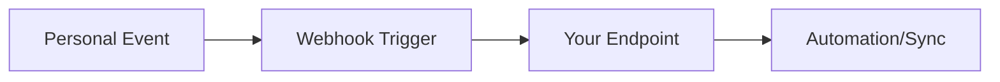

## Overview

Connect Personal to your favorite tools to automate workflows, sync data, and extend functionality. You can integrate with third-party apps, use the REST API for custom solutions, set up webhooks for real-time updates, and handle exports and imports seamlessly.

<Callout kind="info">
Personal supports over 50 native integrations plus unlimited custom options via API and webhooks.
</Callout>

## Third-Party App Connections

Personal offers native integrations with popular tools. Browse the directory in your dashboard at `https://dashboard.example.com/integrations`.

<Columns cols={3}>
  <Card title="Slack" icon="message-circle" href="https://dashboard.example.com/integrations/slack">
    Receive notifications for doc updates and share links directly in channels.
  </Card>
  <Card title="GitHub" icon="github" href="https://dashboard.example.com/integrations/github">
    Sync repositories and automate doc deployments on pull requests.
  </Card>
  <Card title="Zapier" icon="zap" href="https://dashboard.example.com/integrations/zapier">
    Build no-code automations with 5000+ apps.
  </Card>
</Columns>

## API Usage for Custom Integrations

Build custom integrations using Personal's REST API at `https://api.example.com/v1`. Authenticate with `YOUR_API_KEY`.

<Request tabs="JavaScript,cURL" show-lines="true">
  ```javascript
  const response = await fetch('https://api.example.com/v1/docs', {
    method: 'POST',
    headers: {
      'Authorization': `Bearer ${YOUR_API_KEY}`,
      'Content-Type': 'application/json'
    },
    body: JSON.stringify({
      title: 'New Doc',
      content: 'Hello from integration!'
    })
  });
  const data = await response.json();
  console.log(data);
  ```
  ```bash
  curl -X POST https://api.example.com/v1/docs \
    -H "Authorization: Bearer YOUR_API_KEY" \
    -H "Content-Type: application/json" \
    -d '{
      "title": "New Doc",
      "content": "Hello from integration!"
    }'
  ```
</Request>

<Response tabs="200">
  ```json
  {
    "id": "doc_123abc",
    "title": "New Doc",
    "status": "created"
  }
  ```
</Response>

<ParamField path="id" param-type="string" required="true">
  Document identifier.
</ParamField>

<ParamField header="Authorization" param-type="string" required="true">
  Bearer token with `YOUR_API_KEY`.
</ParamField>

## Webhook Setup for Automation

Set up webhooks to receive events like doc updates or user actions. Deliver payloads to your endpoint at `https://your-webhook-url.com/webhook`.

<Steps>
  <Step title="Create Webhook" icon="plus">
    Navigate to `https://dashboard.example.com/settings/webhooks` and click "New Webhook".
  </Step>
  <Step title="Configure Endpoint" icon="link">
    Enter your URL and select events (e.g., `doc.updated`).
  </Step>
  <Step title="Test and Save" icon="check-circle">
    Send a test event and verify receipt.
  </Step>
</Steps>

Example payload:

```json
{
  "event": "doc.updated",
  "data": {
    "id": "doc_123abc",
    "title": "Updated Doc"
  },
  "timestamp": "2024-01-15T10:30:00Z"
}
```

## Export and Import Options

Export docs to Markdown, PDF, or HTML. Import from GitHub, Google Docs, or ZIP files.

<Tabs>
  <Tab title="Export" icon="download">
    Use the API or dashboard export button.

    <CodeGroup tabs="JavaScript,Python">
      ```javascript
      const response = await fetch('https://api.example.com/v1/docs/export', {
        method: 'POST',
        headers: { 'Authorization': `Bearer ${YOUR_API_KEY}` },
        body: JSON.stringify({ format: 'markdown' })
      });
      ```
      ```python
      import requests
      response = requests.post(
        'https://api.example.com/v1/docs/export',
        headers={'Authorization': f'Bearer {YOUR_API_KEY}'},
        json={'format': 'markdown'}
      )
      ```
    </CodeGroup>
  </Tab>
  <Tab title="Import" icon="upload">
    Upload files via dashboard or API.

    ```bash
    curl -X POST https://api.example.com/v1/docs/import \
      -H "Authorization: Bearer YOUR_API_KEY" \
      -F "file=@docs.zip"
    ```
  </Tab>
</Tabs>

## Next Steps

Explore advanced custom integrations in the [API Reference](/api-reference). Test webhooks with tools like ngrok for local development.

<Callout kind="tip">
Start with a simple Slack integration to see immediate value.
</Callout>

